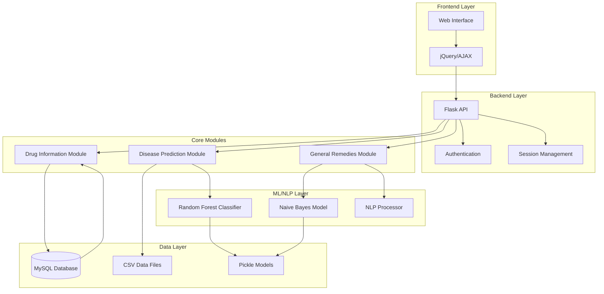

# Automated Healthcare System Using AI-based Chatbot


## Overview
The **Automated Healthcare System** is a full-stack application that integrates Machine Learning (ML) and Natural Language Processing (NLP) to provide healthcare services through an AI-based chatbot. The system is developed using the Flask framework for backend operations and incorporates a user-friendly frontend built with HTML, CSS, and jQuery.

This application provides three core modules:
1. **Drug Information**  
2. **Disease Prediction**  
3. **General Remedies**

## System Architecture



### Architecture Components

#### 1. Frontend Layer
- **Web Interface**: User-facing interface built with HTML/CSS
- **jQuery/AJAX**: Handles asynchronous requests to backend

#### 2. Backend Layer
- **Flask API**: Main application server
- **Authentication**: User session and security management
- **Session Management**: Maintains user state and data

#### 3. Core Modules
- **Disease Prediction**: Processes symptoms and predicts diseases
- **Drug Information**: Manages medicine-related queries
- **General Remedies**: Provides health advice and remedies

#### 4. ML/NLP Layer
- **Random Forest Classifier**: ML model for disease prediction
- **Naive Bayes Model**: Classification for remedies
- **NLP Processor**: Text processing for user queries

#### 5. Data Layer
- **MySQL Database**: Stores drug information and user data
- **CSV Data Files**: Training data for ML models
- **Pickle Models**: Serialized ML model storage

## Features

### 1. Drug Information
- **Functionality**: Retrieves detailed information about any medicine.
- **Implementation**:
  - Uses an external API to fetch data.
  - Integrates MySQL database to store and retrieve drug details.
  - Displays information such as **price**, **usage**, and **side effects** for the queried medicine.

### 2. Disease Prediction
- **Functionality**: Predicts the possible disease based on comma-separated symptoms provided by the user.
- **Implementation**:
  - Utilizes **Random Forest Classifier** achieving 93% accuracy.
  - Maps symptoms with severity levels using a preprocessed CSV file.
  - Trained and saved the model using **pickle**.
  - API call is made to return the predicted disease.

### 3. General Remedies
- **Functionality**: Provides home remedies for general health-related queries.
- **Implementation**:
  - Leverages NLP techniques including **lemmatization** and **tokenization**.
  - Trained a **Multinomial Naïve Bayes** model achieving 95% accuracy.
  - Offers remedies for questions like "How can I cure cuts?".

## Screenshot and Video


## Tech Stack

### Backend:
- **Flask**: For backend logic and API development.
- **MySQL**: For drug information storage and retrieval.

### Frontend:
- **HTML/CSS**: For structuring and styling the web interface.
- **jQuery**: For dynamic UI interactions.

### Machine Learning:
- **Random Forest Classifier**: Used in Disease Prediction.
- **Multinomial Naïve Bayes**: Used in NLP-based General Remedies.

### Tools & Libraries:
- **Pickle**: For model serialization.
- **API Integration**: For fetching external data.

## Installation and Setup

### 1. Clone the Repository
```bash
git clone https://github.com/yash211/Automated-healthcare-system-using-AI-based-Chatbot.git
cd Automated-healthcare-system-using-AI-based-Chatbot
```

### 2. Install Dependencies
```bash
pip install -r requirements.txt
```

### 3. Setup MySQL Database
1. Import the provided SQL file into MySQL.
2. Update database credentials in the Flask configuration.

### 4. Run the Application
```bash
flask run
```

### 5. Access the Web Interface
Open `http://127.0.0.1:5000` in your browser.

## Results

### Drug Information Module:
- Successfully retrieves and displays accurate drug data.

### Disease Prediction Module:
- Achieves high accuracy (93%) for disease prediction based on symptoms.

### General Remedies Module:
- Provides relevant and accurate home remedies (95% accuracy).

## Contributing
Feel free to open an issue or submit a pull request for any feature suggestions or improvements.
